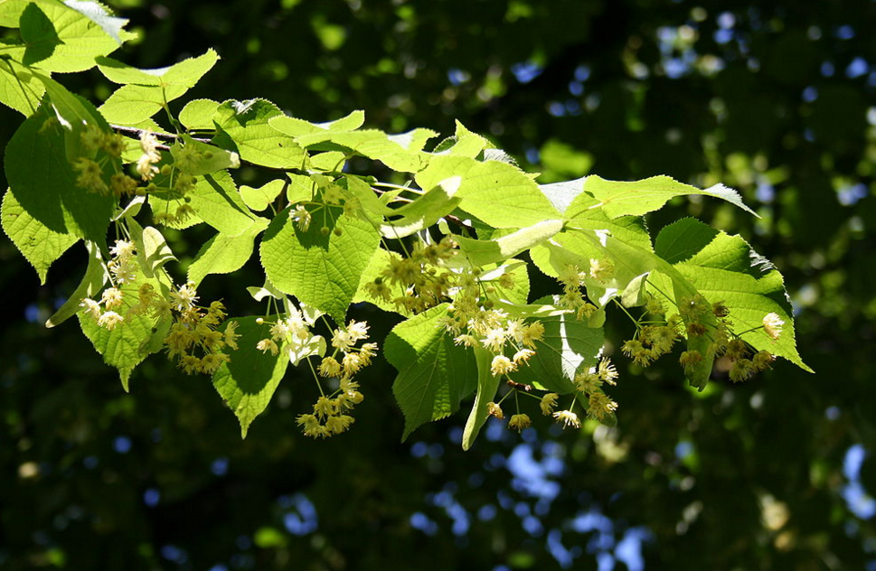
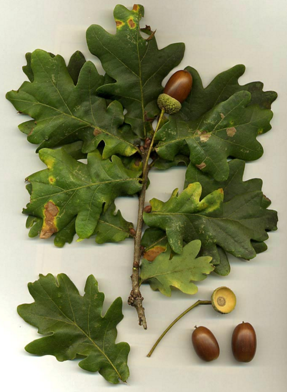
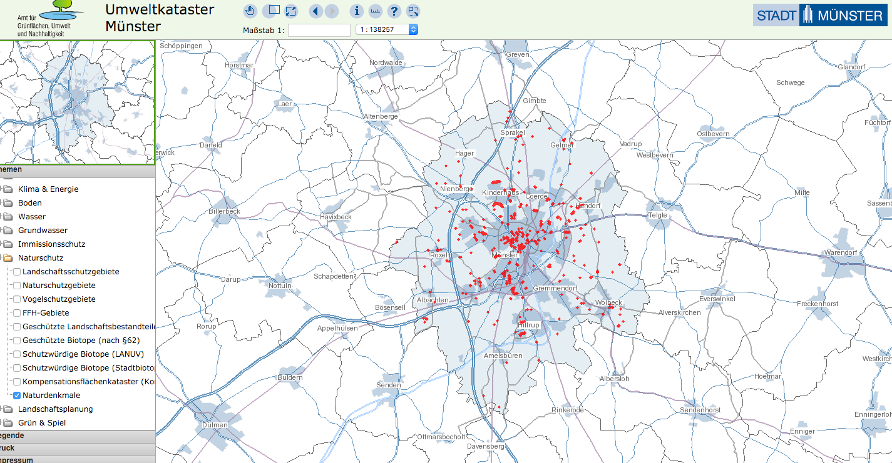
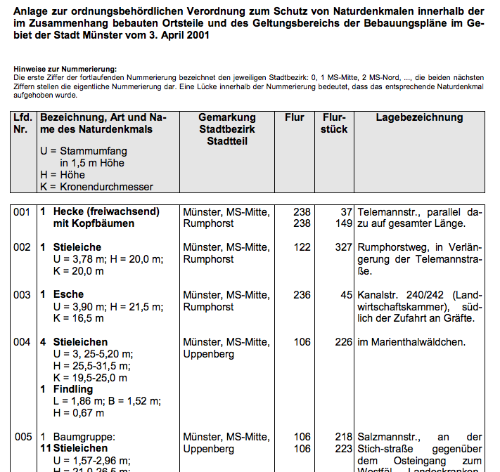

# Available Environmental Resources: Germany

These are very interesting links, filled with environmental data and information specifically for the city of Münster, North Rhein Westfalia or Germany.

# Table of contents

* [Biodiversity](#biodiversity)
* [Waste Management](#wastemanagement)
* [Green City](#green-city)

# Biodiversity
## Tree Biodiversity

Preview <width="1500"/> | Description
-----------|-------------|
<width="150"/> | [Tree of the year](http://www.stadt-muenster.de/umwelt/baeume/baum-des-jahres.html)
|[Common trees in Münster](http://www.stadt-muenster.de/umwelt/baeume/stadtbaeume.html) Linde (24%), oak (21%), maple (14%), hornbeam (8%), plane (5%).
|[Tree's Location map](http://geo.stadt-muenster.de/webgis2/frames/index.php?PHPSESSID=b6c53b7ac9d4af705616d2bc85de9f30&gui_id=Umweltkataster),[Office of green space, the environment and sustainability](http://www.muenster.de/stadt/umwelt/schutzgebiete_naturdenkmale.html)
|[Monument trees in Münster](http://www.stadt-muenster.de/umwelt/natur-und-landschaft/schutzgebiete-naturdenkmale/naturdenkmale.html)

## Bird Biodiversity

1. Specie 1
2. Specie 2
3. Specie 3

## Endangered Species

# Waste Management

* [Actors & initiatives in Münster](http://awm.stadt-muenster.de/abfallvermeidung/muenster-isst-abfallarm/akteure-und-initiativen.html)
* [Waste prevention and Resource Conservation](http://www.wochederabfallvermeidung.de/auftaktveranstaltung/)
* [Wate Managment in Münster ](http://www.stadt-muenster.de/umwelt/boden-und-abfall/abfallwirtschaft.html)

# Renewable Energy
* [Renewable Energy in Münster](http://www.stadt-muenster.de/klima/bauen-sanieren.html)

# Green City
## Münster

* [Green Virtual Tour](http://www.muenster.de/stadt/medien/virtual-tour.html)
* [Nature Reserves](http://www.stadt-muenster.de/umwelt/natur-und-landschaft/schutzgebiete-naturdenkmale/naturschutzgebiete.html) 15 conservation areas - 2,100 hectares
* [Landscape Protection Areas](http://www.stadt-muenster.de/umwelt/natur-und-landschaft/schutzgebiete-naturdenkmale/landschaftsschutzgebiete.html) 9 areas with 9,900 hectares

# License

This code code is available under the [MIT License](http://opensource.org/licenses/MIT). If you do find it useful, please [let me know](mailto:paola.perez@uni-muenster.de).
